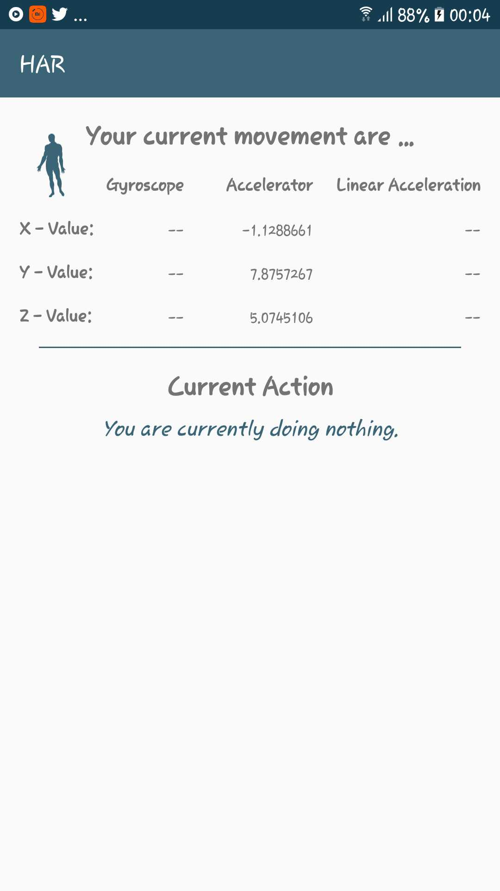

# Har_PytorchAndroid
This is the official repository for the Android Part of the HAR app

This Repo is part of the porject/community *Mobile applications for non intrusive medical surveillance using Human Activity Recognition Technology.*
This REPO in particular aims to combine the different HAR approaches with an intelligent post processing of the recognized activities and implement the whole process in a usable android application. 

* **PytorchScholarAndroid-GitHub-Structure**
--> For now the most important parts can be found in: 
1. The Data-Loading from the UCI in the Notebook of HAR_LSTM and HAR_CNN
2. The RNN-Model in the HAR_RNN_CNN (the training as .... and the saved model as .....)
3. The Android Application in the HAR-Android-Repo

* **How to run the project**  
1. Clone this REPO
2. IMPORT the whole project into Android Studio 
3. Run it on your mobile phone 

--> Downloadable .APK will be uploaded soon 
 
*UNFORTUNATELY the conversion from pytorch to android hasn't quite worked until now!*

* **What are the various command line parameters which could be changed and how to change them**
--> For now only a basic implementation using LSTMs for the HAR without any Post-Processing is implemented 
1. In the future one can choose between different deep learning approaches for the HAR-Algorithm 
2. In addition the Post-Processing algorithm will allow taylored alarms for different critical medical conditions depending on the specific persons that needs surveillance. 

 

## The App - a visual 
*Normally the Gyroscope also works (In this case the gyroscope of the specific smartphone doesn't seem to work)* 

